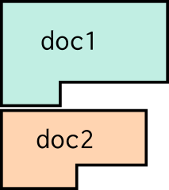
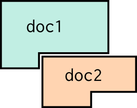
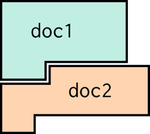

# Pretty Printing Guide

This is the **guide** for the pretty-fast-pretty-printer.


## What is Pretty-Printing?

_If you already know what pretty-printing is and why there might be a library
for it, you can skip this section._

Pretty-printing is the act of _nicely_ printing out source code for a program.
This sounds very easy: just walk the
[AST](https://en.wikipedia.org/wiki/Abstract_syntax_tree), and print out each
construct. When you see an `if`, print out:

    if (THE_CONDITION) {
      THEN_BRANCH
    } else {
      ELSE_BRANCH
    }

and likewise for all the other constructs. It's not _quite_ that easy, because
you need to keep track of indentation: the indentation of `THEN_BRANCH` needs to
be 2 spaces _plus_ whatever indentation the `if` was at. But keeping track of
indentation isn't very hard.

There's basically only one bit of pretty-printing that's actually hard, and
that's splitting up long lines. For example, suppose that `THE_CONDITION` is
very long:

    is_federal_holiday(date) || is_local_holiday(date) || get_weekday_name(date) == "Saturday" || get_weekday_name(date) == "Sunday"

We probably don't want to print that all on one line, because it's ugly and hard
to read. The exact cut-off point of when a line is too long and needs to be
split up should be configurable, but let's suppose for the purpose of this
example that we consider that line to be too long. It should instead be split up
over multiple lines:

    if (is_federal_holiday(date)
        || is_local_holiday(date)
        || get_weekday_name(date) == "Saturday"
        || get_weekday_name(date) == "Sunday") {
        THEN_BRANCH
    } else {
        ELSE_BRANCH
    }

Notice that the `or` (`||`) needs to keep track of indentation: every time it
prints a newline for itself, it needs to print enough spaces to get an
indentation of 4 spaces _plus_ whatever indentation the `if` was at. Essentially
every construct in the language will need to deal with the fact it may need to
be split up over multiple lines, and to keep the correct indentation as it does
so. So manual pretty printing gets _tedious_.

Surprisingly, it also gets hard to do efficiently. When multiple constructs are
nested inside each other, and you're deciding whether each of them should be
split across multiple lines or not, it's very easy to write code that has
exponential running time.

So that's what this library is about: it provides a few simple _combinators_
(read: functions) that take the boilerplate out of pretty printing, and
guarantee a linear running time.

(If you've seen parser combinator libraries, they make a good analogy: pretty
printer combinators are to printing as parser combinators are to parsing.)


## How does this library work?

Pretty printing consists of two steps:

1. You walk the program to be printed and use _combinators_ to build up a `Doc` (short for
"document"), which describes _all possible ways_ that the program can be printed.
2. You call `doc.display(width)` to actually print the program. It returns an
array of lines. `width` is how long you allow lines to be, in characters. (A
"standard" pretty-printing width is 80).

Surprisingly, almost everything you need to do can be done with just four
combinators:

#### Text

`txt("some string")` just prints out `some string`. The string cannot contain
newlines.

#### Vertical Concatenation

`vert(doc1, doc2, ...)` _vertically concatenates_ documents. That is, it
puts one on top of the other, like this:



#### Horizontal Concatenation

`horz(doc1, doc2, ...)` _horizontally concatenates_ documents. More
specifically, it begins printing `doc2` where `doc1` left off, and _keeps
the indentation of the last line of `doc1`_:



#### IfFlat: Choose between two Layouts

`ifFlat(doc1, doc2)` lets you choose between two documents.
It will use `doc1` if it fits entirely on the current line, otherwise
it will use `doc2`.

For most purposes, these four combinators are all that you'll need.

Now let's look at how to use them, with two examples. I chose these examples
to highlight various useful patterns to use when pretty-printing. Each of them
teach different lessons.


## Easy Example: `while`

Let's put all of this together with an example: printing `while` loops:

    while (CONDITION) {
      BODY
    }

We can pretty print them like so:

```js
    // ... supposing we're in a class representing while loops ...
    pretty() {
      let cond = this.condition.pretty();
      let body = this.body.pretty();
      return vert(
        horz(txt("while ("), cond, txt(") {")),
        horz(txt("  "), body),
        txt("}"));
    }

    // to print a `while` object to the console:
    let lines = my_while.pretty().display(80);
    console.log(lines.join("\n"));
```

Importantly, this will behave correctly even if `body` has a newline in it: _both_
lines of `body` will be indented by two spaces plus the indentation of the
`while` loop.

#### Fixed Indentation, a.k.a. "Nesting"

The behavior we want is for `body` to be indented by a constant amount (in this
case, 2 spaces) relative to the `while`. The pretty-printing code above gives an
example of how to do this in a specific case. In general, the pattern looks like
this:

```js
    vert(UNINDENTED, horz(txt("  "), INDENTED))
```

#### Shorthand: Ellide `txt`

You'll notice that the method we wrote uses `txt` a lot. It gets tedious after a
while. However, all of the combinators will automatically wrap any string
arguments they receive in `txt`. So we can write this instead:

```js
    return vert(
      horz("while (", cond, ") {"),
      horz("  ", body),
      "}");
```

#### Shorthand: String Templates

Actually, we can get even more concise. There is a shorthand for building a
`doc` using a
[string template](https://developer.mozilla.org/en-US/docs/Web/JavaScript/Reference/Template_literals)
called `pretty`. Using it, we can simplify down to:

```js
    return pretty`while (${cond}) {\n  ${body}\n}`
```

The `pretty` template accepts template strings that may contain
newlines. It combines the lines with `vert`, and the parts of each
line with `horz`.


## Advanced Example: Wrapping Words using Concat

For a tricker example, let's try to format a paragraph of text by wrapping the
words. That is, we want to get something like this:

     Lorem ipsum dolor sit amet, consectetur adipiscing elit, sed do eiusmod
     tempor incididunt ut labore et dolore magna aliqua. Ut enim ad minim
     veniam, quis nostrud exercitation ullamco laboris nisi ut aliquip ex ea
     commodo consequat. Duis aute irure dolor in reprehenderit in voluptate
     velit esse cillum dolore eu fugiat nulla pariatur. Excepteur sint occaecat
     cupidatat non proident, sunt in culpa qui officia deserunt mollit anim id
     est laborum.

Let's assume that we start with a list of words that we want to wrap:

```js
    function wordWrap(words) {
      ...
    }
```

#### A First Attempt

For each word, we want to either (i) stick it on the end of the last line,
if it fits, or (ii) at the beginning of the next line, if not. Here's a first
attempt:

```js
  // WRONG:
  function wordWrap(words) {
    let paragraph = txt("");
    for (let word of words) {
      paragraph = ifFlat(horz(paragraph, " ", word),
                         vert(paragraph, word));
    }
    return paragraph;
  }
```

And here's what it produces:

    Lorem ipsum dolor sit amet, consectetur adipiscing elit, sed do eiusmod tempor
    incididunt
    ut
    labore
    ...

The issue is that `ifFlat` checks to see whether its first option,
`horz(paragraph, " ", word)`, fits on one line, and as soon as `paragraph` has
more than one line, this first option _will never again_ fit on one line. Thus
`ifFlat` forevermore picks the second option, `vert(paragraph, word)`.

To fix this, we need to move the `ifFlat` choice _deeper_: it can't surround
`paragraph`, because `paragraph` might already fill many lines. Here's a naive
attempt to do so:

```js
  // ALSO WRONG:
  function wordWrap(words) {
    let paragraph = txt("");
    for (let word of words) {
      paragraph = horz(paragraph,
                       ifFlat(horz(" ", word),
                              vert("", word)));
    }
    return paragraph;
  }
```

And here's what it produces:

    Lorem ipsum dolor sit amet, consectetur adipiscing elit, sed do eiusmod tempor
                                                                            incididunt
                                                                            ut
                                                                            labore
                                                                            ...

The issue _now_ is that `vert` _keeps the current indentation_. But that's not
always what we want!

#### Simple Concatenation

In this case, we want `vert` to reset the indentation to the left side of the
paragraph. This actually _cannot be done with the combinators we've introduced
so far_. There's one final combinator that solves this problem, called `concat`.

`concat` is like `horz`, except that it keeps the same indentation level for all
of the documents. Thus `concat(doc1, doc2)` looks like this:



Using it, we can finally fix our example. This code:

```js
  // RIGHT
  function wordWrap(words) {
    let paragraph = txt("");
    for (let word of words) {
      paragraph = concat(paragraph,
                         ifFlat(horz(" ", word),
                                vert("", word)));
    }
    return paragraph;
  }
```

Produces this output:

    Lorem ipsum dolor sit amet, consectetur adipiscing elit, sed do eiusmod tempor
    incididunt ut labore et dolore magna aliqua. Ut enim ad minim veniam, quis
    nostrud exercitation ullamco laboris nisi ut aliquip ex ea commodo consequat.
    Duis aute irure dolor in reprehenderit in voluptate velit esse cillum dolore eu
    fugiat nulla pariatur. Excepteur sint occaecat cupidatat non proident, sunt in
    culpa qui officia deserunt mollit anim id est laborum.

So that's what `concat` can do for you, when you really need it. For most
purposes, though, you'll want to use `horz`.

------

That concludes the guide; you should now have what you need to use the
pretty-fast-pretty-printer. For future reference, you can refer to the more
concice
[reference manual](https://github.com/brownplt/pretty-fast-pretty-printer).
